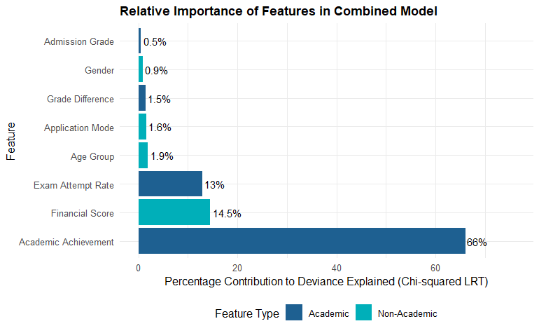
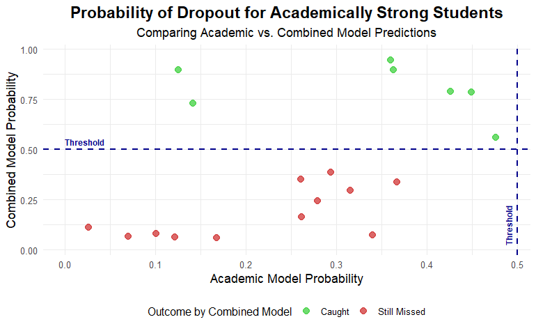
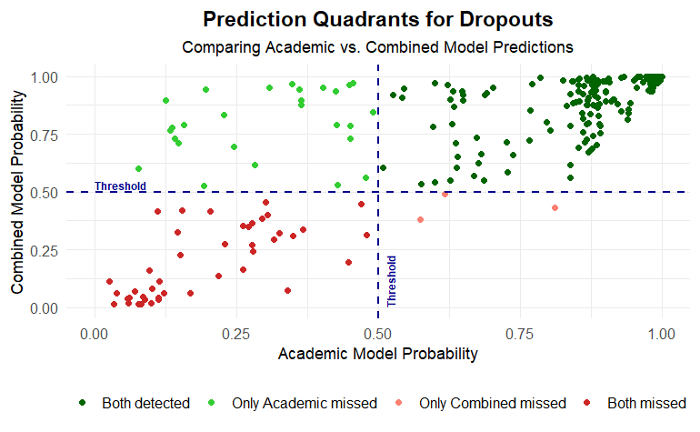
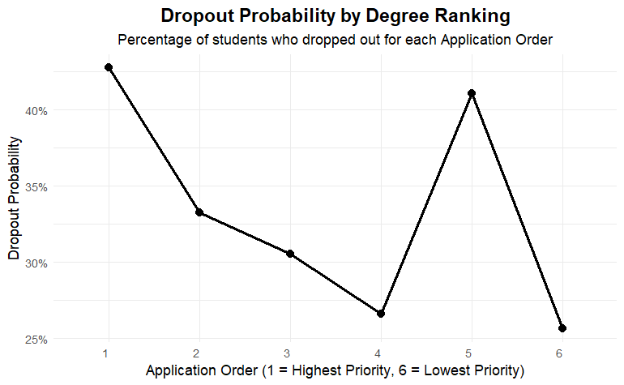
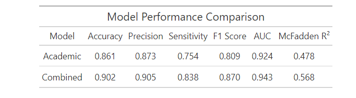

# Student Dropout Prediction and Analysis

## Project Overview

This project focuses on predicting student dropout and academic success, drawing insights from a dataset containing various student attributes, academic performance, and financial information. The primary goal is to develop a robust logistic regression model that can identify students at risk of dropping out, thereby enabling targeted interventions.

We explore the importance of academic versus non-academic factors in predicting dropout. We compare a model built solely on academic features with a comprehensive model that incorporates demographic, financial, and application-related variables. A key part of our analysis involves identifying "academically strong" students who nevertheless drop out, shedding light on the non-academic factors that contribute to their attrition.

## Table of Contents

- [Environment Setup](#environment-setup)
  - [Load Libraries](#load-libraries)
  - [Load and Prepare Data](#load-and-prepare-data)
  - [Feature Engineering: Academic Variables](#feature-engineering-academic-variables)
  - [Feature Engineering: Categorical Variables](#feature-engineering-categorical-variables)
  - [Select Features for Modeling](#select-features-for-modeling)
  - [Split Data into Training and Testing Sets](#split-data-into-training-and-testing-sets)
  - [Perform PCA on Academic and Financial Features](#perform-pca-on-academic-and-financial-features)
  - [Normalize Numeric Features](#normalize-numeric-features)
- [Modeling and Evaluation](#modeling-and-evaluation)
  - [Academic Model](#academic-model)
  - [Combined Model](#combined-model)
  - [Model Performance Comparison](#model-performance-comparison)
- [Key Findings and Visualizations](#key-findings-and-visualizations)
  - [Relative Importance of Features](#relative-importance-of-features)
  - [Analysis of Missed Students](#analysis-of-missed-students)
  - [Academically Strong Dropouts Analysis](#academically-strong-dropouts-analysis)
  - [Prediction Quadrants for Dropouts](#prediction-quadrants-for-dropouts)
  - [Dropout Probability by Application Order](#dropout-probability-by-application-order)

---

# Environment Setup
## load libraries
```R
# Load required libraries
library(dplyr)
library(readr)
library(janitor)
library(caret)
library(pROC)
library(ggplot2)
library(broom)
library(gt)

```
## Read Tables

This project uses several R packages for data manipulation, modeling, and visualization. All necessary libraries are loaded at the beginning of the script.

``` r
# Set a seed for reproducibility
set.seed(42)
Load and Prepare Data
The dataset students_dropout_academic_success.csv is loaded, column names are cleaned, and the data is filtered to include only Dropout or Graduate outcomes. The target variable is then converted to a factor, with Graduate set as the reference level for logistic regression.
```
## Load dataset, clean column names, and filter to Dropout or Graduate only

``` r

df <- read_csv("data/students_dropout_academic_success.csv", show_col_types = FALSE) %>%
  clean_names() %>%
  filter(target %in% c("Dropout", "Graduate"))

# Convert target to factor with 'Graduate' as the reference level
df$target <- factor(df$target, levels = c("Graduate", "Dropout"))
Feature Engineering: Academic Variables
New features are created to capture various aspects of academic performance based on course results from both semesters. These include average_grade_year, grade_difference, total_approved, total_enrolled, course_success_rate, total_evaluated, and exam_attempt_rate.

```
## Create academic performance features based on course results in both semesters

``` r
df <- df %>%
  mutate(
    average_grade_year = rowMeans(
      select(., curricular_units_1st_sem_grade, curricular_units_2nd_sem_grade),
      na.rm = TRUE
    ),
    grade_difference = curricular_units_2nd_sem_grade - curricular_units_1st_sem_grade,
    total_approved = curricular_units_1st_sem_approved + curricular_units_2nd_sem_approved,
    total_enrolled = curricular_units_1st_sem_enrolled + curricular_units_2nd_sem_enrolled,
    course_success_rate = ifelse(total_enrolled == 0, 0, total_approved / total_enrolled),
    total_evaluated = curricular_units_1st_sem_evaluations + curricular_units_2nd_sem_evaluations,
    exam_attempt_rate = ifelse(total_enrolled == 0, 0, total_evaluated / total_enrolled)
  )
Feature Engineering: Categorical Variables
Categorical variables such as gender, application_mode, and age_at_enrollment are recoded into more manageable groups and converted to factors for modeling.
```
## Recode categorical variables: gender, application mode groups, and age groups

``` r
# These transformations prepare categorical features for modeling
df <- df %>%
  mutate(
    gender = factor(
      gender,
      levels = c(0, 1),
      labels = c("Female", "Male")
    ),
    gender = relevel(gender, ref = "Female"),

    application_mode_group = case_when(
      application_mode == 1 ~ "1_Primary General Admission",
      application_mode %in% c(17, 18) ~ "2_Subsequent General Admission",
      application_mode %in% c(15, 39) ~ "3_International Admission",
      application_mode %in% c(5, 16, 42, 43, 44, 51, 53, 57) ~ "4_Island Admission",
      application_mode %in% c(7, 2, 10, 26, 27) ~ "5_Special Admission",
      TRUE ~ "6_Other"
    ),

    age_group = case_when(
      age_at_enrollment <= 18 ~ "Under 18",
      age_at_enrollment <= 20 ~ "19-20",
      age_at_enrollment <= 25 ~ "21-25",
      age_at_enrollment < 120 ~ "Above 26",
      TRUE ~ NA_character_
    )
  )

# Convert grouped variables to factors with defined levels
df$application_mode_group <- factor(df$application_mode_group)
df$age_group <- factor(df$age_group, levels = c("Under 18", "19-20", "21-25", "Above 26"))
Select Features for Modeling
A subset of the engineered features, including admission_grade, grade_difference, exam_attempt_rate, average_grade_year, course_success_rate, scholarship_holder, debtor, tuition_fees_up_to_date, gender, age_group, and application_mode_group, along with the target variable, are selected for model training.
```
## Select relevant features for the logistic regression models

``` r
# Includes academic performance, financial status, demographics, and target variable
model_data <- df %>%
  select(
    admission_grade,
    grade_difference,
    exam_attempt_rate,
    average_grade_year,
    course_success_rate,
    scholarship_holder,
    debtor,
    tuition_fees_up_to_date,
    gender,
    age_group,
    application_mode_group,
    target
  )
Split Data into Training and Testing Sets
The model_data is split into 80% training and 20% testing sets. createDataPartition from the caret package ensures that the stratification of the target variable is maintained across both sets, preserving the proportion of dropouts and graduates.
```
## Split the data into training (80%) and testing (20%) sets, stratified by target variable

``` r
train_index <- createDataPartition(model_data$target, p = 0.8, list = FALSE)
train_data <- model_data[train_index, ]
test_data <- model_data[-train_index, ]

# Ensure categorical variables in test set have the same factor levels as in the train set
for (col in c("age_group", "application_mode_group", "gender")) {
  train_data[[col]] <- factor(train_data[[col]], levels = levels(model_data[[col]]))
  test_data[[col]] <- factor(test_data[[col]], levels = levels(model_data[[col]]))
}
Perform PCA on Academic and Financial Features
Principal Component Analysis (PCA) is applied to reduce the dimensionality and handle multicollinearity within academic performance features (average_grade_year, course_success_rate) and financial status features (scholarship_holder, debtor, tuition_fees_up_to_date). The first principal component for each set is extracted as academic_achievement and financial_score respectively.
```
## Perform PCA to reduce dimensionality of correlated academic performance features

``` r
academic_cols <- c("average_grade_year", "course_success_rate")
pca_academic <- prcomp(train_data[, academic_cols], scale. = TRUE)
train_data$academic_achievement <- predict(pca_academic, newdata = train_data[, academic_cols])[, 1]
test_data$academic_achievement <- predict(pca_academic, newdata = test_data[, academic_cols])[, 1]

# Perform PCA to reduce dimensionality of financial status features
financial_cols <- c("scholarship_holder", "debtor", "tuition_fees_up_to_date")
pca_financial <- prcomp(train_data[, financial_cols], scale. = TRUE)
train_data$financial_score <- predict(pca_financial, newdata = train_data[, financial_cols])[, 1]
test_data$financial_score <- predict(pca_financial, newdata = test_data[, financial_cols])[, 1]
Normalize Numeric Features
Selected numeric features, including the newly created PCA scores, are normalized using centering and scaling (preProcess from caret) to ensure they contribute equally to the model. Original features used in PCA are removed to avoid collinearity.
```
## Normalize numerical features (including PCA scores) using centering and scaling

``` r
numeric_cols <- c("admission_grade", "grade_difference", "exam_attempt_rate",
                  "academic_achievement", "financial_score")
preproc <- preProcess(train_data[, numeric_cols], method = c("center", "scale"))
train_data[, numeric_cols] <- predict(preproc, train_data[, numeric_cols])
test_data[, numeric_cols] <- predict(preproc, test_data[, numeric_cols])

# Remove original features used in PCA to avoid collinearity in modeling
train_data <- train_data %>% select(-all_of(c(academic_cols, financial_cols)))
test_data <- test_data %>% select(-all_of(c(academic_cols, financial_cols)))
Modeling and Evaluation
We train and evaluate two logistic regression models: an "Academic Model" using only academic features and a "Combined Model" incorporating all selected features.

Academic Model
A logistic regression model is trained using only academic-related features: academic_achievement, admission_grade, grade_difference, and exam_attempt_rate. The model's summary and the contribution of each variable (using drop1) are displayed.

```
## Train logistic regression model using only academic-related features

``` r
logistic_model_academic <- glm(target ~ academic_achievement + admission_grade + grade_difference + exam_attempt_rate, data = train_data, family = binomial)
summary(logistic_model_academic)  # Display coefficients and significance
# Call:
# glm(formula = target ~ academic_achievement + admission_grade +
#     grade_difference + exam_attempt_rate, family = binomial,
#     data = train_data)
#
# Coefficients:
#                             Estimate Std. Error z value Pr(>|z|)
# (Intercept)                  -1.7850     0.0465 -38.384  < 2e-16 ***
# academic_achievement         -1.3090     0.0381 -34.385  < 2e-16 ***
# admission_grade              -0.2737     0.0470  -5.823 5.75e-09 ***
# grade_difference              0.4996     0.0390  12.808  < 2e-16 ***
# exam_attempt_rate            -0.3477     0.0406  -8.562  < 2e-16 ***
# ---
# Signif. codes:  0 ‘***’ 0.001 ‘**’ 0.01 ‘*’ 0.05 ‘.’ 0.1 ‘ ’ 1
#
# (Dispersion parameter for binomial family taken to be 1)
#
#     Null deviance: 12157  on 8740  degrees of freedom
# Residual deviance: 8251  on 8736  degrees of freedom
# AIC: 8261
#
# Number of Fisher Scoring iterations: 5
drop1(logistic_model_academic, test = "Chisq")  # Test contribution of each variable
# Single term deletions
#
# Model:
# target ~ academic_achievement + admission_grade + grade_difference +
#     exam_attempt_rate
#                        Df Deviance    AIC     LRT Pr(>Chi)
# <none>                    8251.0 8261.0
# academic_achievement    1   9439.1 9447.1 1188.08   <2e-16 ***
# admission_grade         1   8285.3 8293.3   34.33  4.7e-09 ***
# grade_difference        1   8420.7 8428.7  169.69   <2e-16 ***
# exam_attempt_rate       1   8325.2 8333.2   74.24   <2e-16 ***
# ---
# Signif. codes:  0 ‘***’ 0.001 ‘**’ 0.01 ‘*’ 0.05 ‘.’ 0.1 ‘ ’ 1
The Academic Model's performance is evaluated using a confusion matrix, ROC curve, and AUC score. McFadden's R² is also computed as a measure of model fit.
```
## Predict dropout probabilities and classify based on 0.5 threshold

``` r
predicted_probs_academic <- predict(logistic_model_academic, newdata = test_data, type = "response")
predicted_classes_academic <- ifelse(predicted_probs_academic > 0.5, "Dropout", "Graduate") %>% as.factor()

# Evaluate academic model performance with confusion matrix
cm_academic <- confusionMatrix(predicted_classes_academic, test_data$target, positive = "Dropout")
cm_academic
# Confusion Matrix and Statistics
#
#           Reference
# Prediction Graduate Dropout
#   Graduate     1255     236
#   Dropout        80     225
#
#                Accuracy : 0.8115
#                  95% CI : (0.793, 0.8288)
#     No Information Rate : 0.7787
#     P-Value [Acc > NIR] : 0.000301
#
#                   Kappa : 0.4435
#
#  Mcnemar's Test P-Value : < 2e-16
#
#             Sensitivity : 0.4881
#             Specificity : 0.9399
#          Pos Pred Value : 0.7385
#          Neg Pred Value : 0.8413
#              Prevalence : 0.2213
#          Detection Rate : 0.1080
#    Detection Prevalence : 0.1462
#       Balanced Accuracy : 0.7140
#
#        'Positive' Class : Dropout
```
## Compute ROC curve and AUC for academic model

``` r
roc_academic <- roc(test_data$target, predicted_probs_academic, levels = c("Graduate", "Dropout"), direction = "<")
auc_value_academic <- auc(roc_academic)
print(paste("Academic Model AUC:", round(auc_value_academic, 3)))
# [1] "Academic Model AUC: 0.825"
```
## Calculate McFadden's pseudo-R² as a measure of model fit

``` r
null_model <- glm(target ~ 1, data = train_data, family = binomial)
R2_McFadden <- 1 - (logLik(logistic_model_academic) / logLik(null_model))
print(paste("McFadden's R²:", round(R2_McFadden, 3)))
# [1] "McFadden's R²: 0.321"
Combined Model
A logistic regression model is trained using all selected features (academic_achievement, admission_grade, grade_difference, exam_attempt_rate, financial_score, gender, age_group, application_mode_group). Its summary and variable contributions are also examined.
```
## Train logistic regression model using all selected features (academic + non-academic)

``` r
logistic_model <- glm(target ~ ., data = train_data, family = binomial)
summary(logistic_model)  # View model summary
# Call:
# glm(formula = target ~ ., family = binomial, data = train_data)
#
# Coefficients:
#                                Estimate Std. Error z value Pr(>|z|)
# (Intercept)                     -1.8988     0.0632 -30.046  < 2e-16 ***
# admission_grade                 -0.2982     0.0483  -6.170 6.90e-10 ***
# grade_difference                 0.4905     0.0401  12.235  < 2e-16 ***
# exam_attempt_rate               -0.3429     0.0405  -8.468  < 2e-16 ***
# genderMale                       0.2520     0.0645   3.905 9.40e-05 ***
# age_group19-20                   0.1260     0.0634   1.988   0.0468 *
# age_group21-25                   0.2647     0.0717   3.693   0.0002 ***
# age_groupAbove 26                0.7853     0.0766  10.252  < 2e-16 ***
# application_mode_group2_Subsequent General Admission    0.0416     0.0891   0.467   0.6404
# application_mode_group3_International Admission         -0.1030     0.1989  -0.518   0.6043
# application_mode_group4_Island Admission                -0.4284     0.2319  -1.847   0.0647 .
# application_mode_group5_Special Admission               -0.1011     0.0895  -1.130   0.2587
# application_mode_group6_Other                           -0.2452     0.1171  -2.094   0.0362 *
# academic_achievement            -1.3039     0.0384 -33.957  < 2e-16 ***
# financial_score                 -0.3475     0.0298 -11.666  < 2e-16 ***
# ---
# Signif. codes:  0 ‘***’ 0.001 ‘**’ 0.01 ‘*’ 0.05 ‘.’ 0.1 ‘ ’ 1
#
# (Dispersion parameter for binomial family taken to be 1)
#
#     Null deviance: 12157  on 8740  degrees of freedom
# Residual deviance: 7921  on 8726  degrees of freedom
# AIC: 7951
#
# Number of Fisher Scoring iterations: 5
drop1(logistic_model, test = "Chisq")  # Assess variable contributions
# Single term deletions
#
# Model:
# target ~ admission_grade + grade_difference + exam_attempt_rate +
#     gender + age_group + application_mode_group + academic_achievement +
#     financial_score
#                                         Df Deviance    AIC     LRT Pr(>Chi)
# <none>                                     7921.2 7951.2
# admission_grade                          1   7959.0 7987.0   37.76  8.0e-10 ***
# grade_difference                         1   8071.1 8099.1  149.88   <2e-16 ***
# exam_attempt_rate                        1   7994.4 8022.4   73.18   <2e-16 ***
# gender                                   1   7936.5 7964.5   15.28  9.3e-05 ***
# age_group                                3   8079.1 8103.1  157.90   <2e-16 ***
# application_mode_group                   5   7929.5 7951.5    8.31   0.1402
# academic_achievement                     1   9063.1 9091.1 1141.87   <2e-16 ***
# financial_score                          1   8059.9 8087.9  138.74   <2e-16 ***
# ---
# Signif. codes:  0 ‘***’ 0.001 ‘**’ 0.01 ‘*’ 0.05 ‘.’ 0.1 ‘ ’ 1
The combined model's performance is evaluated with a confusion matrix, ROC curve, and AUC score. McFadden's R² provides a measure of overall model fit.
```
## Predict on test set using combined model and compute confusion matrix

``` r

predicted_probs <- predict(logistic_model, newdata = test_data, type = "response")
predicted_classes <- factor(ifelse(predicted_probs > 0.5, "Dropout", "Graduate"), levels = levels(test_data$target))

cm <- confusionMatrix(predicted_classes, test_data$target, positive = "Dropout")
print(cm)
# Confusion Matrix and Statistics
#
#           Reference
# Prediction Graduate Dropout
#   Graduate     1269     189
#   Dropout        66     272
#
#                Accuracy : 0.8447
#                  95% CI : (0.8279, 0.8605)
#     No Information Rate : 0.7787
#     P-Value [Acc > NIR] : 3.843e-13
#
#                   Kappa : 0.5694
#
#  Mcnemar's Test P-Value : 0.0003046
#
#             Sensitivity : 0.5900
#             Specificity : 0.9506
#          Pos Pred Value : 0.8047
#          Neg Pred Value : 0.8703
#              Prevalence : 0.2213
#          Detection Rate : 0.1303
#    Detection Prevalence : 0.1619
#       Balanced Accuracy : 0.7703
#
#        'Positive' Class : Dropout
```
## Calculate ROC curve and AUC for combined model predictions

``` r
roc_obj <- roc(test_data$target, predicted_probs, levels = c("Graduate", "Dropout"), direction = "<")
auc_value <- auc(roc_obj)
print(paste("AUC:", round(auc_value, 3)))
# [1] "AUC: 0.887"
R

# Compute McFadden's pseudo-R² for the combined model
null_model <- glm(target ~ 1, data = train_data, family = binomial)
R2_McFadden <- 1 - (logLik(logistic_model) / logLik(null_model))
print(paste("McFadden's R²:", round(R2_McFadden, 3)))
# [1] "McFadden's R²: 0.348"
Model Performance Comparison
A table summarizing key performance metrics (Accuracy, Precision, Sensitivity, F1 Score, AUC, McFadden R²) for both the Academic and Combined models. This provides a clear quantitative comparison of their effectiveness.
```
## Compute precision and F1-score for both models

``` r
precision_academic <- as.numeric(cm_academic$byClass["Precision"])
precision_combined <- as.numeric(cm$byClass["Precision"])

f1_academic <- as.numeric(cm_academic$byClass["F1"])
f1_combined <- as.numeric(cm$byClass["F1"])

# Add the new metrics to the results dataframe
results_df <- data.frame(
  Model = c("Academic", "Combined"),
  Accuracy = c(
    as.numeric(cm_academic$overall["Accuracy"]),
    as.numeric(cm$overall["Accuracy"])
  ),
  Precision = c(precision_academic, precision_combined),
  Sensitivity = c(
    as.numeric(cm_academic$byClass["Sensitivity"]),
    as.numeric(cm$byClass["Sensitivity"])
  ),
  F1 = c(f1_academic, f1_combined),
  AUC = c(
    as.numeric(auc_value_academic),
    as.numeric(auc_value)
  ),
  McFadden_R2 = c(
    as.numeric(1 - (logLik(logistic_model_academic) / logLik(null_model))),
    as.numeric(1 - (logLik(logistic_model) / logLik(null_model)))
  )
)

# Round metrics for presentation
results_df <- results_df %>%
  mutate(
    Accuracy = round(Accuracy, 3),
    Precision = round(Precision, 3),
    Sensitivity = round(Sensitivity, 3),
    F1 = round(F1, 3),
    AUC = round(AUC, 3),
    McFadden_R2 = round(McFadden_R2, 3)
  )

# Build and format the updated gt table
gt_table <- results_df %>%
  gt() %>%
  tab_header(
    title = "Model Performance Comparison"
  ) %>%
  cols_label(
    Model = "Model",
    Accuracy = "Accuracy",
    Precision = "Precision",
    Sensitivity = "Sensitivity",
    F1 = "F1 Score",
    AUC = "AUC",
    McFadden_R2 = "McFadden R²"
  ) %>%
  fmt_number(
    columns = c(Accuracy, Precision, Sensitivity, F1, AUC, McFadden_R2),
    decimals = 3
  ) %>%
  cols_align(
    align = "center",
    columns = everything()
  ) %>%
  tab_options(
    table.border.top.width = px(2),
    table.border.bottom.width = px(2),
    column_labels.border.bottom.width = px(1),
    table_body.hlines.width = px(1),
    table_body.vlines.width = px(1)
  )

# Display the table
gt_table


Model	Accuracy	Precision	Sensitivity	F1 Score	AUC	McFadden R²
Academic	0.812	0.739	0.488	0.587	0.825	0.321
Combined	0.845	0.805	0.590	0.681	0.887	0.348

ייצוא אל Sheets
Key Findings and Visualizations
Relative Importance of Features
This bar chart illustrates the relative contribution of each feature to the combined model's predictive power, based on the Chi-squared Likelihood Ratio Test (LRT) from drop1 analysis. Academic and non-academic features are distinctly colored to highlight their respective impacts.
```
## Evaluate feature importance based on Chi-squared deviance reduction from drop1

``` r
drop_results <- drop1(logistic_model, test = "Chisq")

# Focus on relevant features defined in the analysis
relevant_features <- c("academic_achievement", "admission_grade", "grade_difference", "exam_attempt_rate",
                       "financial_score", "gender", "age_group", "application_mode_group")

# Build a dataframe with relative contributions to model performance
feature_importance_df <- data.frame(
  Feature = rownames(drop_results),
  ChiSq = drop_results$LRT
) %>%
  filter(Feature %in% relevant_features) %>%
  filter(Feature != "<none>") %>%
  mutate(
    Percentage = (ChiSq / sum(ChiSq, na.rm=TRUE)) * 100,
    Feature_Label = case_when(
      Feature == "academic_achievement" ~ "Academic Achievement",
      Feature == "admission_grade" ~ "Admission Grade",
      Feature == "grade_difference" ~ "Grade Difference",
      Feature == "exam_attempt_rate" ~ "Exam Attempt Rate",
      Feature == "financial_score" ~ "Financial Score",
      Feature == "gender" ~ "Gender",
      Feature == "age_group" ~ "Age Group",
      Feature == "application_mode_group" ~ "Application Mode",
      TRUE ~ Feature
    ),
    Feature_Type = case_when(
      Feature %in% c("academic_achievement", "admission_grade", "grade_difference", "exam_attempt_rate") ~ "Academic",
      TRUE ~ "Non-Academic"
    )
  ) %>%
  arrange(desc(Percentage))

# Convert feature labels to ordered factors for plotting
feature_importance_df$Feature_Label <- factor(feature_importance_df$Feature_Label,
                                              levels = feature_importance_df$Feature_Label)

# Plot relative importance of features as a horizontal bar chart
ggplot(feature_importance_df, aes(x = Percentage, y = Feature_Label, fill = Feature_Type)) +
  geom_bar(stat = "identity") +
  scale_fill_manual(values = c("Academic" = "#1e6091", "Non-Academic" = "#00afb9")) +
  geom_text(aes(label = paste0(round(Percentage, 1), "%")), hjust = -0.1, size = 3.5) +
  xlim(0, max(feature_importance_df$Percentage) * 1.15) +
  labs(title = "Relative Importance of Features in Combined Model",
       x = "Percentage Contribution to Deviance Explained (Chi-squared LRT)",
       y = "Feature",
       fill = "Feature Type") +
  theme_minimal() +
  theme(
    plot.title = element_text(hjust = 0, face = "bold", size = 12),
    legend.position = "bottom"
  )
```
<!-- -->
## Analysis of Missed Students

``` r

This section quantifies how many actual dropouts were missed by the initial academic model and subsequently correctly identified by the more comprehensive combined model. This highlights the value of including non-academic features.

R

# Identify students who were actual dropouts but predicted as Graduates by the academic model
missed_by_academic <- test_data[test_data$target == "Dropout" & results_df$predicted_academic == "Graduate", ]
num_missed <- nrow(missed_by_academic)

# Predict probabilities for these missed students using the combined model
preds_combined_on_missed <- predict(logistic_model, newdata = missed_by_academic, type = "response")
predicted_missed_classes_combined <- ifelse(preds_combined_on_missed > 0.5, "Dropout", "Graduate") %>% as.factor()

# Calculate how many missed students are now correctly identified by the combined model
caught <- sum(predicted_missed_classes_combined == "Dropout")
percentage_caught <- (caught / num_missed) * 100

cat("--- Analysis of Missed Students ---\n")
cat(sprintf("Academic model missed %d students (actual dropouts).\n", num_missed))
cat(sprintf("Combined model correctly identified %d (%.2f%%) of them.\n\n", caught, percentage_caught))
# --- Analysis of Missed Students ---
# Academic model missed 236 students (actual dropouts).
# Combined model correctly identified 153 (64.83%) of them.
Academically Strong Dropouts Analysis
This scatter plot visualizes the dropout probabilities for "academically strong" students (defined by academic thresholds) as predicted by both the Academic and Combined models. It helps illustrate how non-academic factors influence dropout risk even among high-performing students.

R

academic_threshold <- 0  # Threshold for defining "academically strong" students

# Filter dropouts who show strong academic indicators (e.g., above average scores)
academically_strong_dropouts <- test_data %>%
  filter(target == "Dropout",
         academic_achievement > academic_threshold,
         admission_grade > 0,
         exam_attempt_rate > 0,
         grade_difference >= -0.5)

# Check if any students meet these criteria
if (nrow(academically_strong_dropouts) == 0) {
  message("No academically strong dropouts found with the current academic thresholds. Consider adjusting them.")
} else {
  # Predict dropout probabilities for these students using both models
  probs_academic_strong_academic_model <- predict(logistic_model_academic, newdata = academically_strong_dropouts, type = "response")
  probs_academic_strong_combined_model <- predict(logistic_model, newdata = academically_strong_dropouts, type = "response")

  # Create a dataframe for plotting results
  plot_data_strong <- data.frame(
    P_Academic = probs_academic_strong_academic_model,
    P_Combined = probs_academic_strong_combined_model,
    Caught_by_Combined = ifelse(probs_academic_strong_combined_model > 0.5, "Caught", "Still Missed")
  )

  # Plot scatter showing probabilities of dropout in both models for academically strong dropouts
  ggplot(plot_data_strong, aes(x = P_Academic, y = P_Combined, color = Caught_by_Combined)) +
    geom_point(alpha = 0.7, size = 3) +
    geom_hline(yintercept = 0.5, linetype = "dashed", color = "darkblue", size = 0.8) +
    geom_vline(xintercept = 0.5, linetype = "dashed", color = "darkblue", size = 0.8) +
    annotate("text", x=0.0, y=0.54, label="Threshold", color="darkblue", size=3, fontface="bold", hjust=0) +
    annotate("text", x=0.49, y=0.02, label="Threshold", color="darkblue", angle=90, size=3, fontface="bold", hjust=0) +
    scale_color_manual(values = c("Caught" = "limegreen", "Still Missed" = "firebrick3")) +
    labs(title = "Probability of Dropout for Academically Strong Students",
         subtitle = "Comparing Academic vs. Combined Model Predictions",
         x = "Academic Model Probability",
         y = "Combined Model Probability",
         color = "Outcome by Combined Model") +
    theme_minimal(base_size = 11) +
    theme(
      plot.title = element_text(hjust = 0.5, face = "bold", size = 16),
      plot.subtitle = element_text(hjust = 0.5, size=12),
      axis.title.x = element_text(size=12),
      axis.title.y = element_text(size=12),
      legend.position = "bottom"
    ) +
    scale_x_continuous(breaks = seq(0, 0.5, by = 0.1)) +
    scale_y_continuous(breaks = seq(0, 1, by = 0.25)) +
    coord_cartesian(xlim = c(0, 0.49))
}
```
<!-- -->
## Prediction Quadrants for Dropouts

``` r

This quadrant plot categorizes actual dropouts based on their predicted probabilities from both the Academic and Combined models. It visually distinguishes between cases where both models detected dropout risk, where only one did, or where both missed.

R

academic_threshold <- 0  # Threshold used for defining "good" academic standing (can be adjusted)

# Filter all actual dropouts from the test set
dropout_data <- test_data %>% filter(target == "Dropout")

# Check if there are dropouts available for analysis
if (nrow(dropout_data) == 0) {
  message("No dropouts found for quadrant plot analysis. Consider checking your data or thresholds.")
} else {
  # Generate dropout probabilities from both models for the dropouts subset
  probs_academic_on_strong <- predict(logistic_model_academic, newdata = dropout_data, type = "response")
  probs_combined_on_strong <- predict(logistic_model, newdata = dropout_data, type = "response")

  # Create a dataframe with probabilities and assign each case to a prediction quadrant
  plot_data_quadrant <- data.frame(
    P_Academic = probs_academic_on_strong,
    P_Combined = probs_combined_on_strong
  ) %>%
    mutate(
      Quadrant_Category = case_when(
        P_Academic > 0.5 & P_Combined > 0.5 ~ "Both detected",
        P_Academic <= 0.5 & P_Combined > 0.5 ~ "Only Academic missed",
        P_Academic > 0.5 & P_Combined <= 0.5 ~ "Only Combined missed",
        P_Academic <= 0.5 & P_Combined <= 0.5 ~ "Both missed"
      )
    )

  # Set factor order for consistent legend display
  plot_data_quadrant$Quadrant_Category <- factor(plot_data_quadrant$Quadrant_Category,
                                                 levels = c("Both detected",
                                                            "Only Academic missed",
                                                            "Only Combined missed",
                                                            "Both missed"))

  # Plot scatter with quadrants, threshold lines, and color coding for prediction outcomes
  ggplot(plot_data_quadrant, aes(x = P_Academic, y = P_Combined, color = Quadrant_Category)) +
    geom_point(size = 2) +
    geom_hline(yintercept = 0.5, linetype = "dashed", color = "darkblue", size = 0.8) +
    geom_vline(xintercept = 0.5, linetype = "dashed", color = "darkblue", size = 0.8) +
    annotate("text", x=0.0, y=0.53, label="Threshold", color="darkblue", size=3, fontface="bold", hjust=0) +
    annotate("text", x=0.52, y=0.0, label="Threshold", color="darkblue", angle=90, size=3, fontface="bold", hjust=0) +
    scale_color_manual(values = c(
      "Both detected" = "darkgreen",
      "Only Academic missed" = "limegreen",
      "Only Combined missed" = "salmon",
      "Both missed" = "firebrick3"
    )) +
    labs(title = "Prediction Quadrants for Dropouts",
         subtitle = "Comparing Academic vs. Combined Model Predictions",
         x = "Academic Model Probability",
         y = "Combined Model Probability",
         color = "Prediction Outcome Category") +
    theme_minimal(base_size = 14) +
    theme(
      plot.title = element_text(hjust = 0.5, face = "bold", size = 16),
      plot.subtitle = element_text(hjust = 0.5, size = 12),
      axis.title.x = element_text(size=12),
      axis.title.y = element_text(size=12),
      legend.position = "bottom",
      legend.title = element_blank()
    ) +
    coord_cartesian(xlim = c(0, 1), ylim = c(0, 1))
}
```
<!-- -->
## Dropout Probability by Application Order

``` r

This line plot illustrates how the probability of dropout varies based on a student's application order (priority of their degree choice). This provides insights into the relationship between a student's initial preferences and their likelihood of persisting in their studies.

R

dropout_by_order <- df %>%
  filter(application_order != 0) %>%
  group_by(application_order) %>%
  summarise(
    total = n(),
    dropouts = sum(target == "Dropout"),
    dropout_probability = dropouts / total
  ) %>%
  ungroup()
# Plot dropout probability as a function of application order priority
# This line chart helps visualize how the likelihood of dropout varies by students' application choices
ggplot(dropout_by_order, aes(x = factor(application_order), y = dropout_probability, group = 1)) +
  geom_line(color = "black", size = 1.2) +  # Connect points with a line
  geom_point(color = "black", size = 3) +   # Add data points on the line
  labs(
    title = "Dropout Probability by Degree Ranking",
    subtitle = "Percentage of students who dropped out for each Application Order",
    x = "Application Order (1 = Highest Priority, 6 = Lowest Priority)",
    y = "Dropout Probability"
  ) +
  scale_y_continuous(labels = scales::percent) +  # Display y-axis as percentages
  theme_minimal(base_size = 12) +
  theme(
    plot.title = element_text(hjust = 0.5, face = "bold", size = 16),
    plot.subtitle = element_text(hjust = 0.5, size = 12),
    axis.text.x = element_text(hjust = 1),
    axis.title.x = element_text(size = 12),
    axis.title.y = element_text(size = 12)
  )
```
<!-- -->
## Model Performance Comparison Table

```r

R
# Compute precision and F1-score for both models
precision_academic <- as.numeric(cm_academic$byClass["Precision"])
precision_combined <- as.numeric(cm$byClass["Precision"])

f1_academic <- as.numeric(cm_academic$byClass["F1"])
f1_combined <- as.numeric(cm$byClass["F1"])

# Add the new metrics to the results dataframe
results_df <- data.frame(
  Model = c("Academic", "Combined"),
  Accuracy = c(
    as.numeric(cm_academic$overall["Accuracy"]),
    as.numeric(cm$overall["Accuracy"])
  ),
  Precision = c(precision_academic, precision_combined),
  Sensitivity = c(
    as.numeric(cm_academic$byClass["Sensitivity"]),
    as.numeric(cm$byClass["Sensitivity"])
  ),
  F1 = c(f1_academic, f1_combined),
  AUC = c(
    as.numeric(auc_value_academic),
    as.numeric(auc_value)
  ),
  McFadden_R2 = c(
    as.numeric(1 - (logLik(logistic_model_academic) / logLik(null_model))),
    as.numeric(1 - (logLik(logistic_model) / logLik(null_model)))
  )
)

# Round metrics for presentation
results_df <- results_df %>%
  mutate(
    Accuracy = round(Accuracy, 3),
    Precision = round(Precision, 3),
    Sensitivity = round(Sensitivity, 3),
    F1 = round(F1, 3),
    AUC = round(AUC, 3),
    McFadden_R2 = round(McFadden_R2, 3)
  )

# Build and format the updated gt table
gt_table <- results_df %>%
  gt() %>%
  tab_header(
    title = "Model Performance Comparison"
  ) %>%
  cols_label(
    Model = "Model",
    Accuracy = "Accuracy",
    Precision = "Precision",
    Sensitivity = "Sensitivity",
    F1 = "F1 Score",
    AUC = "AUC",
    McFadden_R2 = "McFadden R²"
  ) %>%
  fmt_number(
    columns = c(Accuracy, Precision, Sensitivity, F1, AUC, McFadden_R2),
    decimals = 3
  ) %>%
  cols_align(
    align = "center",
    columns = everything()
  ) %>%
  tab_options(
    table.border.top.width = px(2),
    table.border.bottom.width = px(2),
    column_labels.border.bottom.width = px(1),
    table_body.hlines.width = px(1),
    table_body.vlines.width = px(1)
  )

# Display the table
gt_table
```
<!-- -->
